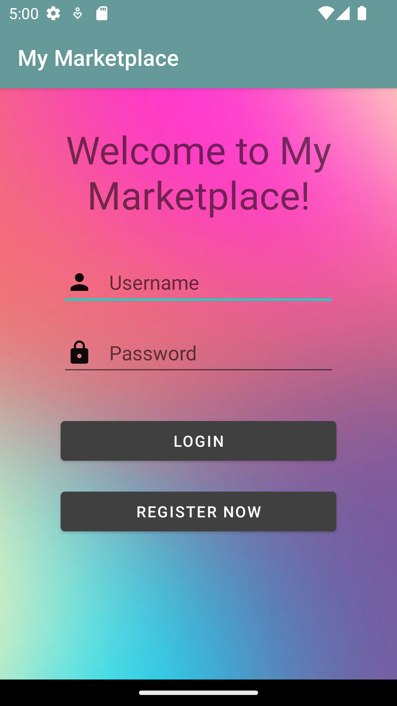
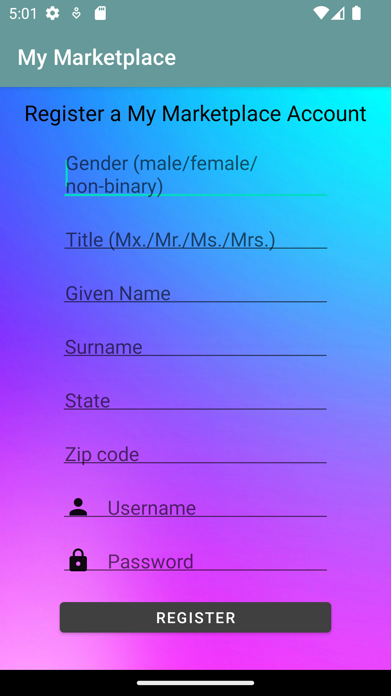
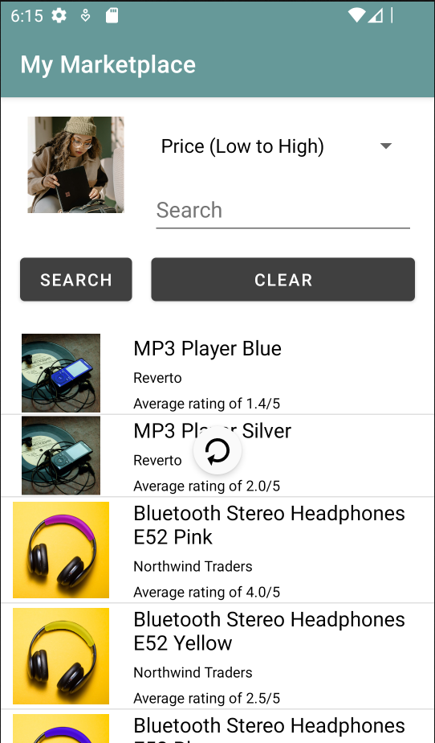
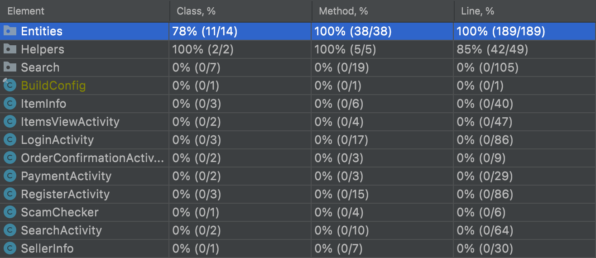

# HD-Believers Report

## Table of Contents

1. [Team Members and Roles](#team-members-and-roles)
2. [Summary of Individual Contributions](#summary-of-individual-contributions)
3. [Conflict Resolution Protocol](#conflict-resolution-protocol)
4. [Application Description](#application-description)
5. [Application UML](#application-uml)
6. [Application Design and Decisions](#application-design-and-decisions)
7. [Summary of Known Errors and Bugs](#summary-of-known-errors-and-bugs)
8. [Testing Summary](#testing-summary)
9. [Implemented Features](#implemented-features)
10. [Team Meetings](#team-meetings)

## Team Members and Roles

| UID | Name | Role |
| :--- | :----: | ---: |
| u1058852 | Andrew Howes | Backend and Data Lead  |
| u6699146 | Long Vu | GUI Lead |
| u7313113 | Matthew Cawley | Search and Filter Lead |
| u7145408 | Vincent Tanumihardja | UI & Data Structure Lead  |

## Summary of Individual Contributions

----------
u1058852, Andrew Howes

I contributed about 30% of the code. Here are the classes that I contributed:
* Users
* Sellers
* Database
* Items
* Stock
* Reviews
* ItemView
* SellerView
* SpamChecker
* Hasher
* ImportingFromCSVTests
* StreamingDataTests
* UserLoginTests

In addition, I also created the data that runs the system, based off of a open source data mining dataset. I generated the stock and review dataset from scratch.

I also collated and edited the photos to match the items.

I proposed and implemented the Singleton design pattern and the Facade design pattern. These were implemented in classes that I created, (Database, Users, Sellers, Items, Stock, Reviews). I proposed the streaming dataset functionality that refreshes when the user triggers a refresh. I also proposed storing data in CSV files and treating it as a Relational Database within Java using IDs to reference other objects.

I assisted with the UI design of ItemView and ItemListView. For ItemListView, I implemented the refresh functionality I created ItemView.

I prepared the slides for our presentation.

----------
u7313113, Matthew Cawley

I contributed about 20% of the code. Here are the classes that I contributed:
* Tokenizer
* Token
* AVLTree: search(), insert(), insert2()
* Node: originally written by Vincent but edited by me to work with the item datatype
* ItemsViewActivity: sortByClicked(), searchButtonPress(), and some parts of onCreate() related to setting up the search bar and dropdown sort menu.

Originally we were going to sort the AVLTree by price, but I proposed we sort it by product name instead. This was because I thought users would be more likely to search by product name, and because this avoids the issue of having multiple products with the same price and how to store that in the tree.

I wasn't a big part of the UI - all I added was the search bar and dropdown search menu.

I wrote the conflict resolution protocol.

I added the grammar/tokenizer section, 50% of the feature list, and the use cases and target audience in the report.

---------
u6699146, Long Vu

I contributed about 15-20% of the code. Here are the classes that I contributed:
* ItemsViewActivity
* ItemInfo
* CustomListViewAdapter

I edited all the layouts of the application to create a cohesive theme. 

I was responsible for making a ListView and add specific details of every items.

I wrote 50% of the features list in the report.

I wrote the app description as well as provided the screenshots of the app in the report.

---------
u7145408, Vincent Tanumihardja

I contributed about 25% of the code. Here are the classes that I contributed:
* loginActivity
* registerActivity
* AVLTree: most of the basic implementation of the tree
* Node: most
* ItemViewActivity: payment button and user profile picture
* PaymentActivity
* OrderConfirmationActivity

I was responsible setting up the project.

I implemented and designed all of the activities above except for ItemViewActivity. 

I was responsible to create a working AVL Tree which was then modified by Matthew so that it works with the correct class type.

I drew the UML diagram for the application.

I added the UML section of this report. 

I wrote the team meeting section of this report.

## Conflict Resolution Protocol

If a member fails to meet a deadline for a task – someone (including possibly said member) takes the task who can complete it as soon as possible.
If there is a disagreement – Vote on it as a group. If this is a 2v2 tie and the nobody wants to budge to the other side then whoever’s job it was to make that part gets final say. 
If a member gets sick and is unable to complete their work, then the other members will have to be distributed their tasks, if possible with later deadlines than originally. 

## Application Description

*MyMarketplace is an application that allows users to browse and buy products. This app specialise in selling tech products and is mainly targeting the gear-heads and gadget nerds audience. This app allows users to purchase products of their liking at just a few finger taps away.*

*Screenshots of MyMarketplace:*

| Login Page | Registration Page | View of Items |
|:-----------|:------------------|:--------------|
 |  | 

| Individual Item | Item Summary | Order Confirmation |
|:----------------|:-------------|:-------------------|
 |  | 

| Seller Information | Scam Detection | Pulldown To Refresh |
|:-------------------|:---------------|:--------------------|
 |  | 

## Application Use Cases and or Examples

*Brandon wants to quickly buy a pair of Bluetooth Headphones online for his friend's birthday*
1. Brandon logs into the app and searches "cat:Bluetooth Headphones" to find all the Bluetooth headphones.
2. Based on the reviews and pricing, he makes a choice and adds a certain pair to the cart.
3. He then selects his preferred shipping option and confirms the order.

*Mary wants to buy a new TV, but she is wary of scams and would rather pick-up the item in-store to get a closer look.*
1. Mary logs into the app and searches "cat:Televisions" to find all the TVs.
2. She ignores any of the options that the spam checker flags as a likely scam.
3. After choosing one, instead of adding to cart, she clicks on the company that sells it.
4. She notes down their location, then drives there to buy the TV.

*Target Users: Those who want to shop online while ensuring they are getting a quality product.*
   * The searching and sorting features make it easier for users to find what they are after more quickly.
   * The scam filter warns users when a product is likely a scam, so they can avoid it.
   * Users can see reviews for each product, giving them more information about their quality.

## Application UML

  

The picture above is the UML Class diagram of the application. Some methods, such as onCreate(), etc. and attributes such as editText, etc. are omitted from the class diagram as it is repetitive. 
The attributes and methods that are present on the diagram above are the significant ones that critically affects the interaction between classes and the whole application.
Although the above UML captures most of the application classes and relations, some classes or relations may not be captured in the UML as it will make the UML very complicated and difficult to read.

[For a clearer view of the UML diagram, click here.](https://lucid.app/lucidchart/a92eeacf-b02d-4aaa-99c8-eb6d099858fa/edit?viewport_loc=-22%2C2082%2C4768%2C2382%2CHWEp-vi-RSFO&invitationId=inv_2984cdd2-f023-4abe-b91f-1f017d5ad0c6)

## Application Design and Decisions

**Data Structures**

Our group used local CSV files to load the data into memory from. This was chosen for their easily processable format and editing. While JSON or XML provide more flexibility, CSV worked well for our very structured data format.

The data was then read into the app and stored as Singleton objects in Users, Sellers and Items. Additional media, like photos, were stored in the drawable file. 

**Tree**

Our group decided to use the AVL Tree to optimize searching items in the marketplace. AVL Tree was chosen as it is one of the simpler tree that is balanced. 

A tree that is easy to manage and also balanced greatly improves time efficiency.

**Design Patterns**

1. Singleton

The singleton design pattern was used to ensure that the there was only ever one instance of the data objects of Users, Items and Sellers. This ensures that there were not multiple representations of these objects which is vital to ensuring that the app was not working on different data.

2. State 

The state design pattern helps to identify the login state of the user. The state design pattern is crucial as only users that are logged can proceed to the marketplace.

3. Facade

The facade design pattern helps to implement the entities so that they are easily accessible. This is important as it makes the entities simpler and more accessible for the other classes.

**Grammar(s)**

Production Rules:
    
    <A> ::= <A+B | B>
    <B> ::= <pname:s | sname:s | cat:s | subcat:s | pricemin:n | pricemax:n>
    <s> :: string (terminal)
    <n> :: integer (terminal)

(with starting symbol A)

The grammar was designed to be simple for the user: they can input the search terms in any order that they want, as all types of search terms are an OR in the production rule from B, and these B's can be contatenated an arbitrary number of times.
Additionally, designing the grammar like this simplifies the tokenizer, as it knows to look for a finite number of B-type strings until it encounters the end.

**Tokenizer and Parsers**

The tokens that the tokenizer uses hold an enum type (such as "pname" for product name) and a string value. (integers are stored as strings). There is also a null enum type to represent invalid search terms.

When the user searches, the tokenizer is called to parse the search into a series of tokens. As explained above, this works by looking for a B-type string such as "pname:MP3 Player" and turning that into a token. If there is a '+' afterwards, look for more tokens after that, and if there is not, finish. If the input is malformed in any way the tokenizer returns a "null" type token, which other parts of the program can understand to be the result of an invalid search term.

Upon receiving the list of tokens, the searcher simply filters the list of all items by recursing through the tokens, except where there is a product name token, in which case it uses the AVLTree first to locate the one (potential) result.

The advantage of this design is that it is simple both in the backend and for the user, and that it can handle invalid search terms.

**Surprise Item**

We successfully implemented the surprise item.
* We created a ScamChecker class that runs a series of tests over an object to produce a ScamScore. This scam score takes into account the following:
   * If an item has very poor reviews it receives a higher ScamScore
   * If an item has no reviews it receives a higher ScamScore
   * If the Items has a seller name that is not the same as the seller name associated with the seller's ID it receives a higher ScamScore. This could prevent people pretending to be reputable brands
* If the ScamScore is above an arbitrary threshold, it marks the item as potential scam and notifies the user, as shown below.

## Summary of Known Errors and Bugs

1. *Bug 1:*

- *A space bar (' ') in the sign in email will crash the application.*

2. *Bug 2:*
- *Sometimes when the app is first run and the buy again button is pressed, the app crashes.*

## Testing Summary

We have done extensive testing to accomplish a high quality app. Unit tests have been created to test the implementation of the backend logic of the app.

* Testing covers the Entities directory with 100% method coverage. This ensures that the data is rendered from the CSV files correctly
* User login tests ensure that the hashing function works correctly and that users can login successfully
* Additional methods test extreme cases to ensure the app can still operate. For instance, StreamingDataTests ensures that the app loops through the streaming data in the unlikely case that the user refreshes the app hundred of times.

  

## Implemented Features

**Feature Category:** Search-related  

1. Feature 1. **Search functionality can handle partially valid and invalid search queries (medium)**
   * ItemsViewActivity, lines 222-237
   * Tokenizer, lines 46-56 and lines 88-92
   * There is an additional type of token called the null token, and when the search term is invalid, the tokenizer instead returns a null token    with the value of this token explaining why it was invalid. When the items view activity receives this token, it does nothing but display a toast with the value of the null token – so explaining what was invalid about the search term. Importantly, this does not crash the app.

2. Feature 2. **Sort a list of products returned from a search based on price, popularity, rating, availability, etc. (easy)**
   * ItemsViewActivity, sortByClicked() (lines 183-202)
   * The user selects a method of sorting (price, reviews, or name) from a dropdown menu, and the items currently being displayed are sorted.

3. Feature 3. **Filter a list of products returned from a search based on their categories (easy)**
   * Every item has a category and subcategory, and these are simply two of the parameters by which you can search by.

 

**Feature Category:** Greater Data Usage, Handling and Sophistication  

1. Feature 1. **Use GPS Information**
   * SellerInfo Class
   * The user can click on a company from one of their products, and the app will display where they are located on an interactable map. Their address is also given as text.

 

**Feature Category:** Creating Processes

1. Feature 1. **Payment Process (easy)**
   * The user have three payment options; they can either pay by Cash, Card or Paypal.
   * Users also have the option to buy the item again using a button the Order Confirmation activity.
   * PaymentActivity: Lines 23-82

2. Feature 2. **Micro Interactions (easy)**
   * The user have the option of adding the selected item to cart.
   * ItemInfo

3. Feature 3. **User Registration**
   * This feature is partially working as the edit texts and button are working as intended. However, the data entered cannot be saved.
   * New users can register to My Marketplace to start browsing through the marketplace.
   * RegisterActivity

**Feature Category:** Greater Data Usage, Handling and Sophistication

1. Feature 1. **User profile activity containing a media file (image, animation, video) (easy).**
   * Display profile picture.
   * ItemsViewActivity: Lines 128, 145-146.

 

## Team Meetings

- *[Team Meeting 1](./meeting minutes/meeting1.md)*
- *[Team Meeting 2](./meeting minutes/meeting2.md)*
- *[Team Meeting 3](./meeting minutes/meeting3.md)*
- *[Team Meeting 4](./meeting minutes/meeting4.md)*
- *[Team Meeting 5](./meeting minutes/meeting5.md)*

 
