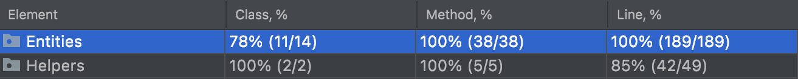

# HD-Believers Report

## Table of Contents

1. [Team Members and Roles](#team-members-and-roles)
2. [Summary of Individual Contributions](#summary-of-individual-contributions)
3. [Conflict Resolution Protocol](#conflict-resolution-protocol)
4. [Application Description](#application-description)
5. [Application UML](#application-uml)
6. [Application Design and Decisions](#application-design-and-decisions)
7. [Summary of Known Errors and Bugs](#summary-of-known-errors-and-bugs)
8. [Testing Summary](#testing-summary)
9. [Implemented Features](#implemented-features)
10. [Team Meetings](#team-meetings)

## Team Members and Roles

| UID | Name | Role |
| :--- | :----: | ---: |
| u1058852 | Andrew Howes | Backend and Data Lead  |
| u6699146 | Long Vu | GUI Lead |
| u7313113 | Matthew Cawley | Search and Filter Lead |
| u7145408 | Vincent Tanumihardja | UI & Data Structure Lead  |

## Summary of Individual Contributions

----------
u1058852, Andrew Howes

I contributed about 30% of the code. Here are the classes that I contributed:
* Users
* Sellers
* Database
* Items
* Stock
* Reviews
* ItemView
* SellerView
* SpamChecker
* Hasher
* ImportingFromCSVTests
* StreamingDataTests
* UserLoginTests

In addition, I also created the data that runs the system, based off of a open source data mining dataset. I generated the stock and review dataset from scratch.
I also collated and edited the photos to match the items.

I proposed and implemented the Singleton design pattern and the Facade design pattern. These were implemented in classes that I created, (Database, Users, Sellers, Items, Stock, Reviews). I proposed the streaming dataset functionality that refreshes when the user triggers a refresh. I also proposed storing data in CSV files and treating it as a Relational Database within Java using IDs to reference other objects.

I assisted with the UI design of ItemView and ItemListView. For ItemListView I implemented the refresh functionality I created ItemView.

I prepared the slides for our presentation.

---------

*[Summarise the contributions made by each member to the project, e.g. code implementation, code design, UI design, report writing, etc.]*

*[Code Implementation. Which features did you implement? Which classes or methods was each member involved in? Provide an approximate proportion in pecentage of the contribution of each member to the whole code implementation, e.g. 30%.]*

*Here is an example:*

*UID1, Name1, I contribute 30% of the code. Here are my contributions:*
* A.class
* B.class: function1(), function2(), ...
* ....

*you should ALSO provide links to the specified classes and/or functions*

*[Code Design. What design patterns, data structures, did the involved member propose?]*

*[UI Design. Specify what design did the involved member propose? What tools were used for the design?]*

*[Report Writing. Which part of the report did the involved member write?]*

*[Slide preparation. Were you responsible for the slides?]*

*[Miscellaneous contributions. You are welcome to provide anything that you consider as a contribution to the project or team.]*

## Conflict Resolution Protocol

*[Write a well defined protocol your team can use to handle conflicts. That is, if your group has problems, what is the procedure for reaching consensus or solving a problem?
(If you choose to make this an external document, link to it here)]*

## Application Description

*[What is your application, what does it do? Include photos or diagrams if necessary]*

*Here is a pet specific application example*

*PetBook is a social media application specifically targetting pet owners... it provides... certified practitioners, such as veterians are indicated by a label next to their profile...*

**Application Use Cases and or Examples**

*[Provide use cases and examples of people using your application. Who are the target users of your application? How do the users use your application?]*

*Here is a pet training application example*

*Molly wants to inquiry about her cat, McPurr's recent troublesome behaviour*
1. *Molly notices that McPurr has been hostile since...*
2. *She makes a post about... with the tag...*
3. *Lachlan, a vet, writes a reply to Molly's post...*
4. ...
5. *Molly gives Lachlan's reply a 'tick' response*

*Here is a map navigation application example*

*Targets Users: Drivers*

* *Users can use it to navigate in order to reach the destinations.*
* *Users can learn the traffic conditions*
* ...

*Target Users: Those who want to find some good restaurants*

* *Users can find nearby restaurants and the application can give recommendations*
* ...

*List all the use cases in text descriptions or create use case diagrams. Please refer to https://www.visual-paradigm.com/guide/uml-unified-modeling-language/what-is-use-case-diagram/ for use case diagram.*

## Application UML

  
*[Replace the above with a class diagram. You can look at how we have linked an image here as an example of how you can do it too.]*

## Application Design and Decisions

*Please give clear and concise descriptions for each subsections of this part. It would be better to list all the concrete items for each subsection and give no more than `5` concise, crucial reasons of your design. Here is an example for the subsection `Data Structures`:*

*I used the following data structures in my project:*

1. *LinkedList*

   * *Objective: It is used for storing xxxx for xxx feature.*

   * *Locations: line xxx in XXX.java, ..., etc.*

   * *Reasons:*

     * *It is more efficient than Arraylist for insertion with a time complexity O(1)*

     * *We don't need to access the item by index for this feature*

2. ...

3. ...

**Data Structures**

Our group used local CSV files to load the data into memory from. This was chosen for their easily processable format and editing. While JSON or XML provide more flexibility, CSV worked well for our very strucuted data format.

The data was then read into the app and stored as Singleton objects in Users, Sellers and Items. Additional media, like photos, were stored in the drawable file. 

**Design Patterns**

1. Singleton

The singleton design pattern was used to ensure that the there was only ever one instance of the data objects of Users, Items and Sellers. This ensures that there were not multiple representations of these objects which is vital to ensuring that the app was not working on different data.

**Grammar(s)**

Production Rules:
    
    <Non-Terminal> ::= <some output>
    <Non-Terminal> ::= <some output>

*[How do you design the grammar? What are the advantages of your designs?]*

*If there are several grammars, list them all under this section and what they relate to.*

**Tokenizer and Parsers**

*[Where do you use tokenisers and parsers? How are they built? What are the advantages of the designs?]*

**Surprise Item**

We succesfully implemented the surprise item.
* We created a ScamChecker class that runs a series of tests over an object to produce a ScamScore. This scam score takes into account the following:
   * If an item has very poor reviews it recieves a higher ScamScore
   * If an item has no reviews it recieves a higher ScamScore
   * If the Items has a seller name that is not the same as the seller name associated with the seller's ID it recieves a higher ScamScore. This could prevent people pretending to be reputable brands
* If the ScamScore is above an arbitrary threshold, it marks the item as potential scam and notifies the user, as shown below.

**Other**

*[What other design decisions have you made which you feel are relevant? Feel free to separate these into their own subheadings.]*

## Summary of Known Errors and Bugs

*[Where are the known errors and bugs? What consequences might they lead to?]*

*Here is an example:*

1. *Bug 1:*

- *A space bar (' ') in the sign in email will crash the application.*
- ...

2. *Bug 2:*
3. ...

*List all the known errors and bugs here. If we find bugs/errors that your team does not know of, it shows that your testing is not thorough.*

## Testing Summary

We have done extensive testing to accomplish a high quality app. Unit tests have been created to test the implementation of the backend logic of the app.

* Testing covers the Entities directory with 100% method coverage. This ensures that the data is rendered from the CSV files correctly
* User login tests ensure that the hashing function works correctly and that users can login successfully
* Additional methods test extreme cases to ensure the app can still operate. For instance, StreamingDataTests ensures that the app loops through the streaming data in the unlikely case that the user refreshes the app hundred of times.

  

## Implemented Features

*[What features have you implemented?]*

*Here are some examples:*

Feature Category: Privacy  
*Implemented features:*
1. Feature 1: **Users may ... . (easy)**
   * Class X, methods Z, Y, Lines of code: 10-100
   * Class Y, methods K, L, M, Lines of code: 35-150
   * Your description: ...
 
2. Feature 2: **A user can only ... . (medium)**
 

Feature Category: Firebase Integration  
*Implemented features:*  
1. **Use Firebase to implement user Authentication/Authorisation. (easy)**
   * Class A: methods A, B, C, lines of code: whole file
   * …

*List all features you have completed in their separate categories with their difficulty classification. If they are features that are suggested and approved, please state this somewhere as well.*

## Team Meetings

*Here is an example (you could start numbering your meetings from 1):*

- *[Team Meeting 0](./meeting0.md)*
- ...

* Link to the minutes of your meetings as above. There must be at least 4 team meetings. 
Note that you must commit your minute meetings shortly after your meeting has taken place (e.g., within 24h), otherwise your meeting minute will not be accepted.
Uour meetings should also have a reasonable date span across Week 6 to 11.*
 
